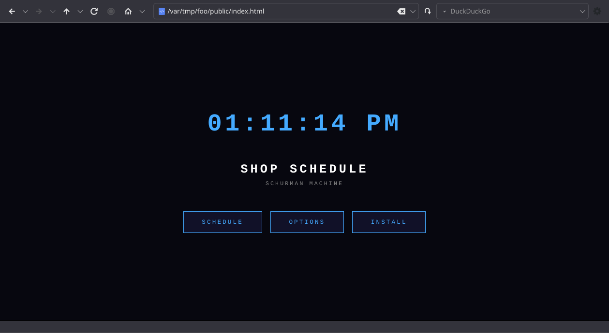
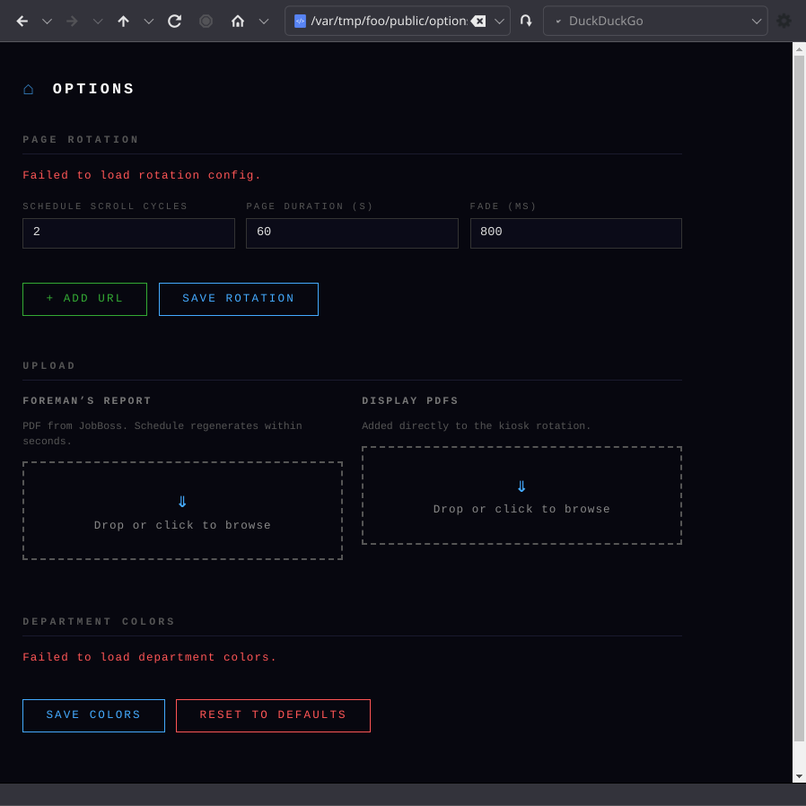
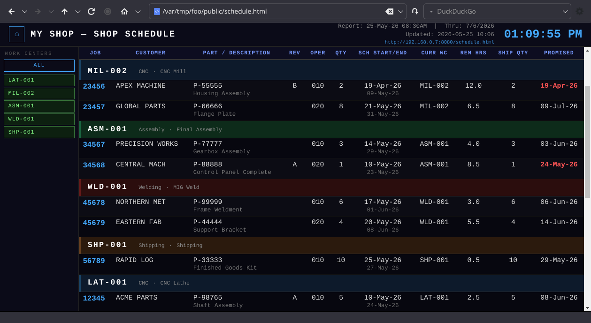

# Shop Schedule

Single Board Computer kiosk display for a machine shop floor. Every 15 minutes (via cron), pulls the current Foreman's Report data and serves an auto-scrolling HTML schedule on a wall-mounted screen.

> Two ways to get data in: **query JobBoss directly** over the network (preferred — see [JobBoss DB source](#jobboss-db-source)), or poll a Gmail inbox for the Foreman's Report PDF export (**deprecated**, see [Gmail/PDF source (deprecated)](#gmailpdf-source-deprecated) — the report is emailed as a PDF attachment and picked up automatically, or you can drop a PDF directly into the `incoming/` folder, which is unaffected by the deprecation). If `JOBBOSS_DB_HOST` is set in `.env`, the DB path is used and the Gmail/PDF settings are ignored.

## Screenshots

| Landing page | Options | Schedule |
|---|---|---|
|  |  |  |

## How it works

1. `run_update.sh` is called by cron every 15 minutes
2. It loads credentials from `.env` and runs `update_schedule.py`
3. If `JOBBOSS_DB_HOST` is set, it queries JobBoss directly for open operations scheduled within `JOBBOSS_DAYS_AHEAD` days; otherwise it checks Gmail for an unread email with a PDF attachment and parses it (**deprecated** — see [Gmail/PDF source (deprecated)](#gmailpdf-source-deprecated))
4. `schedule.html` is regenerated and picked up live by Chromium in kiosk mode

## JobBoss DB source

Queries `Job`, `Job_Operation`, and `Work_Center` directly — no export/email step needed. Only the columns needed for display are selected (no pricing, cost, or margin fields).

**Use a dedicated read-only login**, not an existing admin/user account — if this device or its `.env` is ever compromised, a read-only login scoped to three tables is a much smaller exposure than whatever broader access an existing login has. Run as a JobBoss DB admin:

```sql
CREATE LOGIN shop_schedule_ro WITH PASSWORD = 'choose-a-strong-password';
USE <your_jobboss_database>;
CREATE USER shop_schedule_ro FOR LOGIN shop_schedule_ro;
GRANT SELECT ON dbo.Job TO shop_schedule_ro;
GRANT SELECT ON dbo.Job_Operation TO shop_schedule_ro;
GRANT SELECT ON dbo.Work_Center TO shop_schedule_ro;
```

Then set in `.env`:

```dotenv
JOBBOSS_DB_HOST='SMI-APP02\JBSQL'
JOBBOSS_DB_PORT=
JOBBOSS_DB_NAME=<your_jobboss_database>
JOBBOSS_DB_USER=shop_schedule_ro
JOBBOSS_DB_PASS=<the-password-from-above>
JOBBOSS_DAYS_AHEAD=14
```

Use the exact `Server` value from your SQL Server ODBC DSN (Windows: ODBC Data Sources → System DSN → your DSN → Configure) for `JOBBOSS_DB_HOST` — for a named instance like `SMI-APP02\JBSQL`, leave `JOBBOSS_DB_PORT` blank and it resolves the real port automatically via the SQL Browser service, the same way the ODBC driver does it for Excel/Power Query. Only set `JOBBOSS_DB_PORT` if that resolution isn't available (e.g. the browser service/UDP 1434 is firewalled) and a DBA has given you a static port instead.

**Quote the host value if it contains a backslash** — `run_update.sh` sources `.env` with bash, which silently strips an unquoted backslash. `JOBBOSS_DB_HOST='SMI-APP02\JBSQL'`, not `JOBBOSS_DB_HOST=SMI-APP02\JBSQL`.

The device needs network access to the SQL Server (same LAN as the shop floor is normally sufficient — both the resolved TCP port and UDP 1434 if using instance-name resolution). Uses [`python-tds`](https://pypi.org/project/python-tds/) — pure Python, no native ODBC driver to install, which matters on ARM boards where Microsoft's ODBC driver support is inconsistent.

> **Known gap:** `Promised` and `Ship Qty` aren't sourced from the DB yet (not yet located in the schema) and display blank in this mode — overdue-date highlighting is inactive until that's resolved. Everything else (job, customer, part, work center, schedule dates, remaining hours) matches the real Foreman's Report, verified against production data.

> **Known limitation — unencrypted transport:** `pytds` doesn't encrypt the connection unless given a CA certificate file (`cafile`), which this project doesn't currently configure. Credentials and job/customer data travel in plaintext between the device and the SQL Server. This matches the existing trust model for this server — the reference ODBC DSN itself is configured with `Data Encryption: No` — so this doesn't introduce a new exposure beyond what Excel/Power Query access already has, but it's not a step forward either. Properly fixing this needs the SQL Server's certificate (SQL Server auto-generates a self-signed one by default even when unused) exported to the device and passed as `cafile`, which requires server access this project doesn't assume. Worth revisiting if/when someone with DBA access on `SMI-APP02\JBSQL` is available.

## Gmail/PDF source (deprecated)

**Deprecated in favor of the [JobBoss DB source](#jobboss-db-source) above — plan to migrate.** Gmail polling stays functional for now (each run prints a deprecation notice to stderr/cron log when it's used) but will be removed in a future version. It exists for installs that can't reach the JobBoss SQL Server over the network yet.

```dotenv
GMAIL_USER=your@gmail.com
GMAIL_PASS=xxxx-xxxx-xxxx-xxxx   # Gmail App Password — https://myaccount.google.com/apppasswords
PDF_COMPANY_NAME="Your Company Name"   # Optional — skips this line during PDF parsing
PDF_FILENAME=foremans_report.pdf        # Optional — avoids accidentally parsing a stray PDF
```

Leave `JOBBOSS_DB_HOST` unset to use this path: `update_schedule.py` checks Gmail for an unread email with a PDF attachment, saves and parses it. **Not affected by this deprecation:** manually dropping a PDF into `incoming/` (or via the web upload UI / SMB share — see [Uploading files](#uploading-files) and [SMB file drop](#smb-file-drop-windows--mac) below) still works the same way either way, since it's `parse_pdf()` doing the work either way — only the *automatic Gmail checking* is going away.

## Requirements

- Single Board Computer (tested on BananaPi M4 zero) running Armbian v26.2.1
- Python 3 with `pdfplumber` and `python-tds` (`pip3 install pdfplumber python-tds`)
- Chromium browser
- Either: network access to the JobBoss SQL Server (see above), or a Gmail account with IMAP enabled and an [App Password](https://myaccount.google.com/apppasswords) for the PDF fallback

## Setup

```bash
# Clone on the Pi
git clone https://github.com/i-machine-things/shop-schedule.git ~/shop-schedule
cd ~/shop-schedule

# Run the installer (installs deps, sets up cron, starts kiosk service)
bash install.sh
```

The installer creates `.env` from the example — edit it with your credentials before the first run. At minimum:

```dotenv
SHOP_NAME="Your Shop Name"   # Shown in the page header and browser title
```

Then either fill in the `JOBBOSS_DB_*` block (preferred — see [JobBoss DB source](#jobboss-db-source) below) or, only if DB access isn't available yet, `GMAIL_USER`/`GMAIL_PASS` (**deprecated**, see [Gmail/PDF source (deprecated)](#gmailpdf-source-deprecated)).

## Remote access

Once the installer runs, the kiosk and schedule are served over HTTP on port 8080:

```text
http://<pi-ip>:8080/              ← landing page
http://<pi-ip>:8080/kiosk.html    ← kiosk display with page rotation
http://<pi-ip>:8080/schedule.html ← raw schedule table (no rotation)
http://<pi-ip>:8080/options.html  ← rotation config, uploads, and department colors
http://<pi-ip>:8080/schedule.json ← same data as JSON, for non-browser clients
```

The schedule polls for updates every 60 seconds and swaps in new content without reloading.

## Non-browser clients

`schedule.json` carries the same `{report_date, thru_date, sections}` data used internally to render the HTML pages — regenerated on every `update_schedule.py` run, served as a static file (no extra endpoint). Useful for any display that can't run a browser, e.g. [**shop-schedule-roku**](https://github.com/i-machine-things/shop-schedule-roku), a native Roku kiosk channel that polls this and renders the table natively (Roku's public SDK has no web-view component to show `kiosk.html` directly).

## Client kiosks

Any number of display-only screens can be set up as clients pointing at the server. On a fresh Armbian/Debian machine on the same network:

```bash
curl http://<server-ip>:8080/install | bash
```

Or navigate to `http://<server-ip>:8080/install.html` for a copyable one-liner with management commands. The script installs a minimal X11 + Chromium session and a systemd service (`shop-kiosk.service`) that polls the server on boot until it is reachable before opening the browser — so the display recovers automatically after power outages regardless of which device boots first.

> **Note:** `curl | bash` over plain HTTP is only safe on a trusted local network. To verify the script before running it, download it first (`curl -O http://<server-ip>:8080/install`), inspect it, then execute it manually.

## Uploading files

Navigate to `http://<pi-ip>:8080/options.html` from any device on the same network (Upload section).

- **Foreman's Report** — drop the PDF exported from JobBoss. The schedule regenerates automatically within a few seconds (same as dropping it in `incoming/`).
- **Display PDFs** — drop any PDF to add it to the kiosk rotation. It appears immediately in the list and will show as a slide the next time the kiosk loops. Remove it from the list to delete it from the rotation.

Uploaded display PDFs are stored in `public/raw/` and their entries are managed automatically in `public/pages.json`.

## SMB file drop (Windows / Mac)

The installer sets up a guest-accessible Samba share pointing at `incoming/`. From any machine on the same network:

- **Windows:** `\\<device-ip>\schedule-drop` — map as a network drive if desired
- **Mac:** `smb://<device-ip>/schedule-drop` in Finder → Go → Connect to Server

No password is needed — connect as guest. Drop a PDF and the schedule regenerates within seconds.

## Work center filter

The schedule page has a fixed sidebar listing every work center in the current report. Tapping a WC solos it (first tap); subsequent taps toggle additional WCs in or out. Tapping the sole active WC resets to showing all. The **All** button at the top also resets to the full view.

## Page rotation

The kiosk can rotate through additional web pages between schedule views. After the schedule has scrolled a configurable number of times, it fades to the next page, holds it, then fades back.

Edit `public/pages.json` on the Pi to configure:

```json
{
  "scroll_cycles": 2,
  "page_duration": 60,
  "transition_ms": 800,
  "after_page": "schedule",
  "pages": [
    "https://example.com/safety-notice",
    { "url": "https://example.com/dashboard", "duration": 30 }
  ]
}
```

| Key | Default | Description |
|-----|---------|-------------|
| `scroll_cycles` | `2` | Full scrolls through the schedule before switching |
| `page_duration` | `60` | Seconds to show each page (overridable per page) |
| `transition_ms` | `800` | Crossfade duration in milliseconds |
| `after_page` | `"schedule"` | `"schedule"` — return to schedule after each page, cycling through the list one at a time; `"next"` — play all pages in sequence before returning |

The schedule scroll is paused while a page is displayed and resumes from the same position on return. Leave `pages` as an empty array to disable rotation.

## Manual test

```bash
# Regenerate schedule.html from the existing last_report.pdf (skips email):
GMAIL_USER='' python3 update_schedule.py

# Or drop a PDF into incoming/ and let process_drop.py handle it:
cp /path/to/report.pdf incoming/
python3 process_drop.py
```

`process_drop.py` picks the newest PDF in `incoming/`, copies it to `last_report.pdf`, moves all processed files to `incoming/processed/`, then calls `update_schedule.py` to regenerate the HTML.

## Files

| File | Purpose |
|------|---------|
| `update_schedule.py` | Picks DB vs email/PDF source, HTML and JSON generation |
| `jobboss_db.py` | JobBoss DB source — connects, queries, shapes data for `generate_html()`/`generate_json()` |
| `public/schedule.json` | Same schedule data as JSON, for non-browser clients (gitignored, regenerated every run) |
| `process_drop.py` | Drop-dir handler — picks up PDFs from `incoming/` and regenerates the schedule |
| `server.py` | HTTP server — serves `public/` and handles file-upload API (`/api/upload/*`, `/api/raw/*`) |
| `run_update.sh` | Cron wrapper — loads `.env` and calls the script |
| `install.sh` | One-time server setup: deps, cron job, kiosk and HTTP server services |
| `install-client.sh` | Client kiosk installer — served pre-filled via `GET /install`; creates `shop-kiosk.service` on the client |
| `foreman-kiosk.service` | systemd service (server) — opens Chromium in kiosk mode pointing at `kiosk.html` |
| `foreman-server.service` | systemd service — runs `server.py` on port 8080 |
| `public/install.html` | Web UI showing the copyable client install one-liner |
| `public/options.html` | Admin UI — page rotation config, uploads, and department color pickers |
| `public/kiosk.html` | Rotation shell — wraps the schedule and fades to configured pages |
| `pages.json.example` | Template for `public/pages.json` (the page rotation config) |
| `.env.example` | Credential template (copy to `.env` and fill in) |
| `incoming/` | Drop PDFs here; run `process_drop.py` to ingest them |
| `public/raw/` | Display PDFs uploaded via the web UI (gitignored) |

## Display

The generated `schedule.html` is a full-screen table grouped by work centre. It auto-scrolls continuously and polls for new content every 15 seconds, swapping in updates without a page reload. Overdue promised dates are highlighted in red.

A **light/dark mode toggle** (☀/☾) appears in the header of the schedule, kiosk, index, and options pages. The preference is stored in `localStorage` and shared across all pages on the same origin, so flipping it once applies everywhere.

PDFs uploaded via the Options → Upload section are displayed in the kiosk page-rotation overlay using a built-in PDF viewer (`pdf-viewer.html`) that renders pages as canvases and auto-scrolls from top to bottom over the configured display duration. Requires internet access to load PDF.js from cdnjs.
